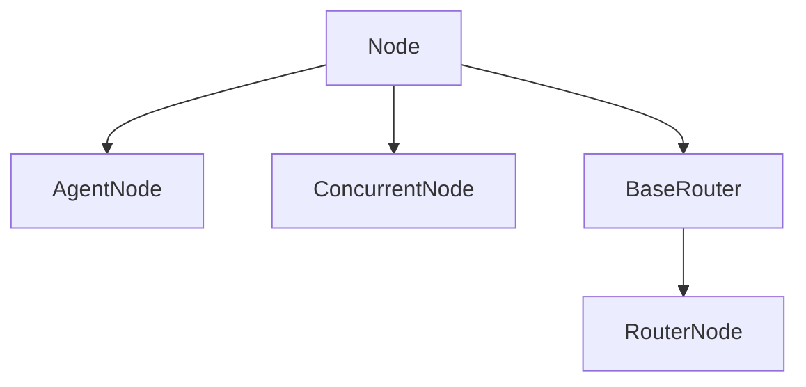

# Types of Nodes

## Overview

<Info>
Nodes are the building blocks for processing steps within the workflows. There are currently four primary node types, each with a specific purpose and designed to handle different aspects of data processing and workflow control.
</Info>

<CardGroup cols={2}>
  <Card title="Node" icon="cube" href="#base-node">
    Performs basic processing tasks with custom logic
  </Card>
  <Card title="AgentNode" icon="robot" href="#agent-node">
    Handles processing using Large Language Models (LLM)
  </Card>
  <Card title="ConcurrentNode" icon="arrows-split-up-and-left" href="#concurrent-node">
    Executes multiple nodes concurrently for better performance
  </Card>
  <Card title="BaseRouter" icon="route" href="#router-node">
    Directs data flow using conditional routing logic
  </Card>
</CardGroup>

## Node Architecture

Each node type serves a distinct purpose in the workflow ecosystem:

<Tabs>
  <Tab title="Processing Nodes">
    **Node** and **AgentNode** are designed for data transformation and processing:
    - **Node**: Custom processing logic for any computational task
    - **AgentNode**: LLM-powered processing for AI-driven operations
  </Tab>
  
  <Tab title="Control Nodes">
    **ConcurrentNode** and **BaseRouter** manage workflow execution flow:
    - **ConcurrentNode**: Parallel execution of independent operations
    - **BaseRouter**: Conditional branching based on processing results
  </Tab>
</Tabs>

## When to Use Each Node Type

<Steps>
  <Step title="Choose Node for Custom Logic">
    Use the base **Node** class when you need to implement custom processing logic, data validation, or any computational task that doesn't require AI capabilities.
  </Step>
  
  <Step title="Choose AgentNode for AI Processing">
    Use **AgentNode** when your processing step requires natural language understanding, generation, or any task that benefits from large language model capabilities.
  </Step>
  
  <Step title="Choose ConcurrentNode for Parallel Processing">
    Use **ConcurrentNode** when you have multiple independent operations that can run simultaneously to improve performance and reduce total execution time.
  </Step>
  
  <Step title="Choose BaseRouter for Conditional Flow">
    Use **BaseRouter** when you need to direct workflow execution down different paths based on processing results or business logic conditions.
  </Step>
</Steps>

## Node Hierarchy

<Info>
All specialized node types inherit from the base `Node` class, ensuring a consistent interface while providing specialized functionality for different use cases.
</Info>

## Design Principles

<AccordionGroup>
  <Accordion title="Single Responsibility">
    Each node type has a clear, single responsibility that aligns with its specific use case in the workflow processing pipeline.
  </Accordion>
  
  <Accordion title="Extensibility">
    The abstract base classes allow for easy extension and customization while maintaining consistent interfaces across the system.
  </Accordion>
  
  <Accordion title="Composability">
    Nodes can be easily combined and connected to create complex workflows that leverage the strengths of each node type.
  </Accordion>
  
  <Accordion title="Consistency">
    All nodes share common patterns for context management, error handling, and result storage, ensuring predictable behavior.
  </Accordion>
</AccordionGroup>

## Next Steps

<CardGroup cols={2}>
  <Card title="Base Node Implementation" icon="code" href="/genai-core-base-node">
    Learn how to implement the foundational Node class
  </Card>
  <Card title="AgentNode with LLMs" icon="brain" href="/genai-core-agent-node">
    Discover how to integrate AI capabilities into your workflows
  </Card>
  <Card title="Concurrent Processing" icon="bolt" href="/genai-core-concurrent-node">
    Implement parallel processing for better performance
  </Card>
  <Card title="Workflow Routing" icon="map" href="/genai-core-router-node">
    Create dynamic routing logic for complex workflows
  </Card>
</CardGroup>